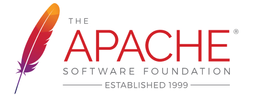

# Management-system-front-end

------

## 🚀学习 Vve3 构建管理系统前端

> 链接为管理系统后端代码库
>
> ⚓https://github.com/Spicy-Rabbit-Head/Management-system

------

## 📚简介

本项目是为学习记录而生,记录了从零开始学习构建一个基于 Spring Boot + Vue3
的前后端分离项目.

该库为前端代码

## 🤓前端技术栈

    

        
     

------

## 🤔后端技术栈

    

 
 
   

